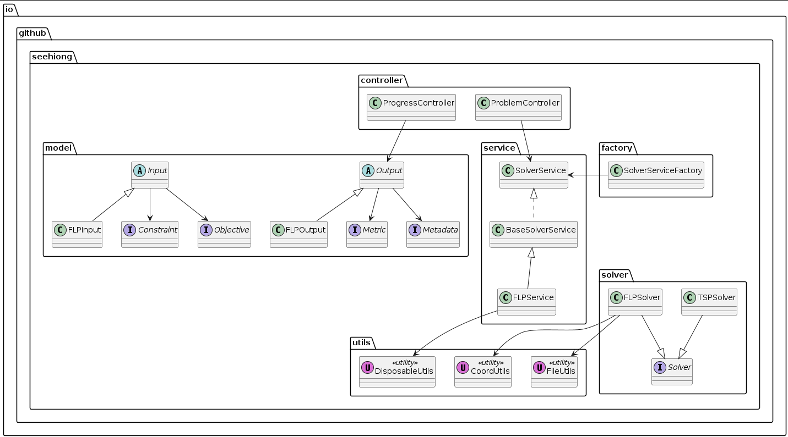
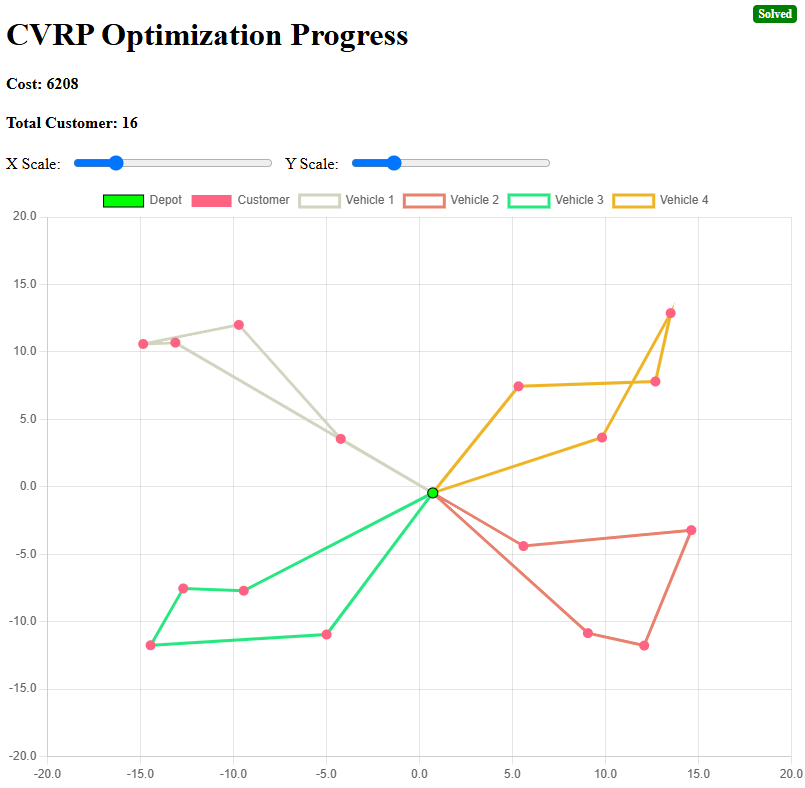

# Micronaut Optimizer

## Rationale

This repository contains the Micronaut Optimizer project, which aims to optimize various computational problems using the Micronaut framework. The project leverages the power of Micronaut for building lightweight, modular, and efficient applications.

## Architecture

The architecture of the Micronaut Optimizer is visualized using PlantUML. Below is the updated PlantUML diagram representing the high-level architecture of the project.



### Key Features

* Real-time Progress Monitoring: View optimization progress through SSE (Server-Sent Events)
* Multiple Solver Support:
  * Traveling Salesman Problem (TSP)
  * Facility Location Problem (FLP)
* Interactive Visualization: Dynamic visualization of solution progress
* Factory Pattern: Extensible solver framework

### Sample Progress Images

* FLP Progress


* TSP Progress


* CVRP Progress



### Sample Inputs

#### FLP Input Json

* Post to `http://localhost:8080/solve/flp`
* Navigate to `http://localhost:8080/flp-progress.html?&xScale=1500&yScale=1500&solverId=<SOLVER_ID>` for progess:

```json
{
    "facilityCostConstraint": {
        "costs": [100, 100, 100]
    },
    "facilityCapacityConstraint": {
        "capacities": [100, 100, 500]
    },    
    "facilityCoordinateConstraint": {
        "coordinates": [
            {"x": "1065", "y": "1065"},
            {"x": "1062", "y": "1062"},
            {"x": "0",    "y": "0"}
        ]
    },
    "customerCoordinateConstraint": {
        "coordinates": [
            {"x": "1397", "y": "1397"},
            {"x": "1398", "y": "1398"},
            {"x": "1399", "y": "1399"},
            {"x": "586",  "y": "586"},
            {"x": "900",  "y": "900"},
            {"x": "910",  "y": "910"},
            {"x": "1200", "y": "1200"},
            {"x": "1210", "y": "1210"}
        ]
    },
    "customerDemandConstraint": {
        "demands": [50, 50, 75, 75, 80, 80, 90, 90]
    }
}
```

#### TSP Input Json

* Post to `http://localhost:8080/solve/tsp`
* Navigate to `http://localhost:8080/tsp-progress.html?&xScale=5&yScale=5&solverId=<SOLVER_ID>` for progess:

```json
{
    "distanceMatrixConstraint": {
        "distances": [
            [ 0, 10, 15, 20, 25 ],
            [10,  0, 35, 25, 20 ],
            [15, 35,  0, 30, 10 ],
            [20, 25, 30,  0, 15 ],
            [25, 20, 10, 15,  0 ]
        ]
    },
    "solveTimeConstraint": {
        "solveTime": "30s"
    },
    "minMaxObjective": {
        "minMaxEnum": "MINIMIZE"
    }
}
```

#### CVRP Input Json

* Post to `http://localhost:8080/solve/cvrp`
* Navigate to `http://localhost:8080/cvrp-progress.html?&xScale=20&yScale=20&solverId=<SOLVER_ID>` for progess:

```json
{
    "vehicleConstraint": {
        "vehicleNumber": 4,
        "capacity": 15
    },
    "customerDemandConstraint": {
        "demands": [0, 1, 1, 2, 4, 2, 4, 8, 8, 1, 2, 1, 2, 4, 4, 8, 8]
    },
    "distanceMatrixConstraint": {
        "distances": [
            [0, 548, 776, 696, 582, 274, 502, 194, 308, 194, 536, 502, 388, 354, 468, 776, 662],
            [548, 0, 684, 308, 194, 502, 730, 354, 696, 742, 1084, 594, 480, 674, 1016, 868, 1210],
            [776, 684, 0, 992, 878, 502, 274, 810, 468, 742, 400, 1278, 1164, 1130, 788, 1552, 754],
            [696, 308, 992, 0, 114, 650, 878, 502, 844, 890, 1232, 514, 628, 822, 1164, 560, 1358],
            [582, 194, 878, 114, 0, 536, 764, 388, 730, 776, 1118, 400, 514, 708, 1050, 674, 1244],
            [274, 502, 502, 650, 536, 0, 228, 308, 194, 240, 582, 776, 662, 628, 514, 1050, 708],
            [502, 730, 274, 878, 764, 228, 0, 536, 194, 468, 354, 1004, 890, 856, 514, 1278, 480],
            [194, 354, 810, 502, 388, 308, 536, 0, 342, 388, 730, 468, 354, 320, 662, 742, 856],
            [308, 696, 468, 844, 730, 194, 194, 342, 0, 274, 388, 810, 696, 662, 320, 1084, 514],
            [194, 742, 742, 890, 776, 240, 468, 388, 274, 0, 342, 536, 422, 388, 274, 810, 468],
            [536, 1084, 400, 1232, 1118, 582, 354, 730, 388, 342, 0, 878, 764, 730, 388, 1152, 354],
            [502, 594, 1278, 514, 400, 776, 1004, 468, 810, 536, 878, 0, 114, 308, 650, 274, 844],
            [388, 480, 1164, 628, 514, 662, 890, 354, 696, 422, 764, 114, 0, 194, 536, 388, 730],
            [354, 674, 1130, 822, 708, 628, 856, 320, 662, 388, 730, 308, 194, 0, 342, 422, 536],
            [468, 1016, 788, 1164, 1050, 514, 514, 662, 320, 274, 388, 650, 536, 342, 0, 764, 194],
            [776, 868, 1552, 560, 674, 1050, 1278, 742, 1084, 810, 1152, 274, 388, 422, 764, 0, 798],
            [662, 1210, 754, 1358, 1244, 708, 480, 856, 514, 468, 354, 844, 730, 536, 194, 798, 0]
        ]
    },
    "solveTimeConstraint": {
        "timeInSeconds": "10"
    }
}
```

## Folder Structure

The folder structure of the project is as follows:

```text
micronaut-optimizer/
├── src/main/
│   ├── java/io/github/seehiong/
│   │   ├── controller/   # REST endpoints
│   │   ├── factory/      # Solver factory implementation
│   │   ├── micronaut/    # Application configuration
│   │   ├── model/        # Data models and DTOs
│   │   ├── service/      # Business logic layer
│   │   ├── solver/       # Optimization algorithms
│   │   └── utils/        # Utility classes
│   └── resources/
│       ├── application.yml  # Micronaut configuration
│       ├── logback.yml      # Logging configuration
│       └── static/          # Static resources (HTML, CSS, JS)
│           ├── flp-progress.html
│           ├── tsp-progress.html
│           └── cvrp-progress.html
├── build.gradle
├── settings.gradle
├── README.md
```

## Prerequisites

* Java 21 or higher
* Gradle 8.11 or higher
* Web browser with SSE support

## Installation

1. Clone the repository:

```shell
git clone https://github.com/seehiong/micronaut-optimizer.git
cd micronaut-optimizer
```

2. Build the project:

```shell
./gradlew clean build
```

3. Run the application:

```shell
./gradlew run
```

4. Access the visualization:

* TSP Progress: http://localhost:8080/tsp-progress.html
* FLP Progress: http://localhost:8080/flp-progress.html

## API Endpoints

```text
POST /solve/{problem}           # Solve a problem with raw input
POST /solve/{problem}/upload    # Solve a problem with file upload
GET /progress/latest/{solverId} # Get the latest output for a solver
GET /progress/{solverId}        # Stream optimization progress
```

## Contributing

1. Fork the repository
2. Create a feature branch
3. Submit a pull request

## License

MIT License